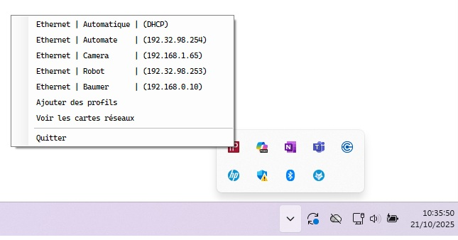
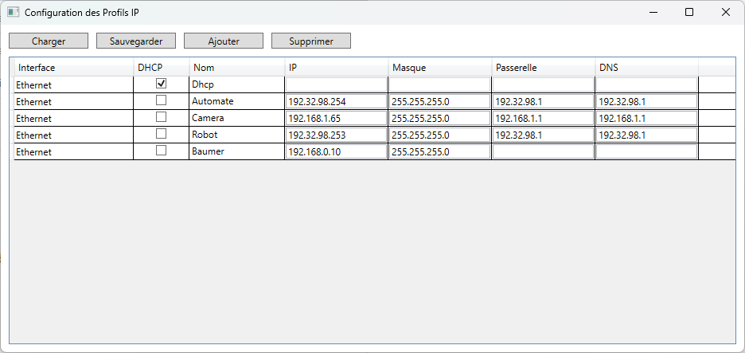

# IPTraySwitcher

<!-- LOGO -->

  

## 1 - TELECHARGER

IPTraySwitcher est une application Windows qui permet d'appliquer des profils d'adresses IP sur les cartes réseaux.

Télécharger l'installateur➡️ [Setup](https://github.com/tonycab/IPTraySwitcher/releases/download/V0.0.1/IPTraySwitcher_Installer.exe)

## 2 - COMMENCER

L'application ajoute un icone dans la barre d'état.

<!-- Tray -->

  

Un clic droit sur l'icône permet de sélectionner le profil à appliquer sur une interface réseau.

<!-- Menu -->

  

## 3 - PARAMETRAGE

Il est possible d'ajouter ou d'importer des profiles.

<!-- Tray -->

  

## 4 - AMELIORATION A FAIRE

- [x] Afficher les interfaces réseau windows
- [ ] Ajouter la possibilité d'activé ou désactivé des interfaces réseau

(<a href="#readme-top">Back to top</a>)

